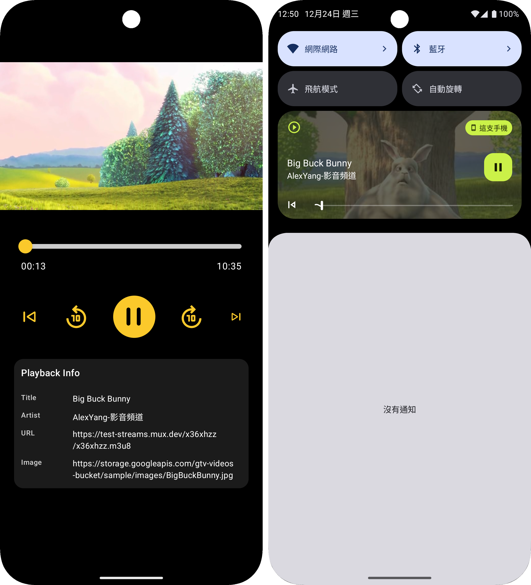

# Alex ExoPlayer HLS Compose

一個使用 Jetpack Compose 和 Media3 ExoPlayer 構建的現代化 Android HLS 串流播放器應用。

本專案以 Jetpack Compose、Media3 ExoPlayer、Hilt DI 與 MVVM + UI State 架構實作現代化的影音串流播放器。 專注於 清晰架構、可維護性、高可擴充性，示範如何在 Android 中正確地實作 ExoPlayer HLS 播放、控制邏輯與自訂 UI、ForegroundService。

## 📱 功能特性
---

### 核心功能
- ✅ HLS (HTTP Live Streaming) 串流播放
- ✅ 前台服務支援（背景播放）
- ✅ 通知欄媒體控制
- ✅ 自定義進度條（支援拖曳）
- ✅ 播放/暫停控制
- ✅ 快轉/快退（1秒、10秒）
- ✅ 實時進度更新
- ✅ 完整的 MediaSession

## Demo

| Screenshot                            |
|---------------------------------------|
|  |


## 🏗️ 架構設計
---
### 整體架構

```
app/
├── data/                    # 數據層
│   ├── model/              # 數據模型
│   ├── notification/       # 通知管理
│   └── service/            # 服務層
├── player/                 # 播放器模組
│   └── presentation/       # UI 層
│       ├── component/      # UI 組件
│       └── di/            # 依賴注入
└── ui/                     # UI 主題
    └── theme/
```

### 技術棧

#### 核心框架
- **Jetpack Compose** - 現代化 UI 框架
- **Kotlin Coroutines & Flow** - 異步處理
- **Hilt** - 依賴注入
- **Media3 ExoPlayer** - 媒體播放引擎

#### 主要依賴
```kotlin
// --- ExoPlayer ---
implementation("androidx.media3:media3-exoplayer:1.9.0")
implementation("androidx.media3:media3-ui:1.9.0")
implementation("androidx.media3:media3-exoplayer-hls:1.9.0")
implementation("androidx.media3:media3-session:1.9.0")
```

## 📦 模組詳解
---
### 1. Data Layer

#### AppNotificationChannel
```kotlin
@Singleton
class AppNotificationChannel @Inject constructor(
    @ApplicationContext val context: Context
)
```
- 管理通知頻道創建
- 支援 Android O+ 通知系統
- 配置媒體播放通知重要性

#### PlaybackNotificationData
```kotlin
data class PlaybackNotificationData(
    val url: String,
    val title: String,
    val artist: String,
    val artwork: String
)
```
- 封裝播放通知所需資料
- 包含媒體 URL、標題、藝術家、封面圖

#### PlaybackService
```kotlin
@AndroidEntryPoint
class PlaybackService : MediaSessionService()
```
**核心職責：**
- 前台服務管理
- MediaSession 生命週期
- 通知欄控制器
- Intent 動作處理（PLAY/PAUSE/STOP）

**關鍵特性：**
- 繼承 `MediaSessionService` 支援標準媒體控制
- 使用 `PlayerNotificationManager` 自動管理通知
- 實現 `NotificationAdapter` 自定義通知內容
- 處理應用移除時的清理工作

### 2. Presentation Layer

#### PlayerViewModel
```kotlin
@HiltViewModel
class PlayerViewModel @Inject constructor(
    @ApplicationContext private val appContext: Context,
    private val exoPlayer: ExoPlayer
) : ViewModel()
```

**狀態管理：**
```kotlin
data class PlayerUiState(
    val currentMills: Long = 0L,
    val totalMills: Long = 0L,
    val isPlaying: Boolean = false,
)
```

**主要功能：**
- ✅ ExoPlayer 生命週期管理
- ✅ 播放狀態監聽
- ✅ 進度追蹤（200ms 更新間隔）
- ✅ 服務控制（透過 Intent）
- ✅ 時間軸操作（seek, skip）

**進度追蹤機制：**
```kotlin
private fun startProgressTracker() {
    progressJob = viewModelScope.launch {
        while (true) {
            _uiState.update { it.copy(currentMills = exoPlayer.currentPosition) }
            delay(200L)
        }
    }
}
```

#### PlayerScreen
主要播放器 UI 容器，整合所有子組件。

**UI 結構：**
```
Column
├── AndroidView (ExoPlayer UI)
├── PlayerSlider (進度條)
├── PlayerAction (控制按鈕)
└── PlayInfo (播放信息)
```

#### PlayerSlider
自定義進度條組件

**技術亮點：**
- 🎨 自定義 Track（支援圓角、高度調整）
- 🎯 自定義 Thumb（立體陰影效果）
- ⚡ 流暢的拖曳體驗
- 🕐 時間格式化顯示（mm:ss）

**核心實現：**
```kotlin
Slider(
    track = { state ->
        Box { /* 自定義背景 */ }
        Box { /* 已播放進度 */ }
    },
    thumb = {
        Box { /* 自定義拖曳點 */ }
    },
    onValueChangeFinished = {
        onSeekTo((sliderValue * safeDuration).toLong())
    }
)
```

#### PlayerAction
播放控制按鈕組

**功能按鈕：**
- ⏮️ 後退 1 秒
- ⏪ 後退 10 秒
- ⏯️ 播放/暫停
- ⏩ 前進 10 秒
- ⏭️ 前進 1 秒

**UI 設計：**
- 中央播放按鈕：72dp，黃色圓形背景
- 10 秒按鈕：60dp
- 1 秒按鈕：36dp/26dp
- 統一黃色主題（#FBC92B）

#### PlayInfo
播放信息展示卡片

**顯示內容：**
- 標題（Title）
- 藝術家（Artist）
- 串流 URL
- 封面圖片 URL

### 3. Dependency Injection（依賴注入）

#### PlayerModule
```kotlin
@Module
@InstallIn(SingletonComponent::class)
object PlayerModule
```

**提供者：**
```kotlin
@Provides
@Singleton
fun provideExoPlayer(
    @ApplicationContext context: Context
): ExoPlayer {
    val audioAttributes = AudioAttributes.Builder()
        .setUsage(C.USAGE_MEDIA)
        .setContentType(C.AUDIO_CONTENT_TYPE_MOVIE)
        .build()

    return ExoPlayer.Builder(context)
        .setAudioAttributes(audioAttributes, true)
        .build()
}
```

**關鍵配置：**
- 單例模式確保應用內共享同一播放器實例
- 音訊屬性配置為媒體內容
- 支援音訊焦點處理

## 🔧 技術實現細節

### 1. 前台服務與通知

#### 權限配置（AndroidManifest.xml）
```xml
<uses-permission android:name="android.permission.INTERNET" />
<uses-permission android:name="android.permission.POST_NOTIFICATIONS" />
<uses-permission android:name="android.permission.FOREGROUND_SERVICE" />
<uses-permission android:name="android.permission.FOREGROUND_SERVICE_MEDIA_PLAYBACK" />
```

#### Service 聲明
```xml
<service
    android:name=".data.service.PlaybackService"
    android:exported="false"
    android:foregroundServiceType="mediaPlayback" />
```

#### 通知管理
```kotlin
PlayerNotificationManager.Builder(context, NOTIFICATION_ID, CHANNEL_ID)
    .setMediaDescriptionAdapter(NotificationAdapter())
    .setNotificationListener(NotificationListener())
    .build()
```

### 2. 播放器狀態同步

#### ViewModel → Service
```kotlin
private fun sendAction(action: String, data: PlaybackNotificationData?) {
    val intent = Intent(appContext, PlaybackService::class.java).apply {
        this.action = action
        data?.let { /* 添加 extras */ }
    }
    ContextCompat.startForegroundService(appContext, intent)
}
```

#### Service → Player
```kotlin
override fun onStartCommand(intent: Intent?, flags: Int, startId: Int): Int {
    when (intent?.action) {
        ACTION_PLAY -> {
            prepareFromIntent(intent)
            exoPlayer.play()
        }
        ACTION_PAUSE -> exoPlayer.pause()
        ACTION_STOP -> stopAndReset()
    }
    return START_NOT_STICKY
}
```

#### Player → ViewModel
```kotlin
private val playerListener = object : Player.Listener {
    override fun onIsPlayingChanged(isPlaying: Boolean) {
        _uiState.update { it.copy(isPlaying = isPlaying) }
    }
    
    override fun onPlaybackStateChanged(state: Int) {
        if (state == Player.STATE_READY) {
            val mills = exoPlayer.duration
            if (mills > 0) {
                _uiState.update { it.copy(totalMills = mills) }
            }
        }
    }
}
```

### 3. HLS 媒體準備

```kotlin
private fun prepareFromIntent(intent: Intent) {
    val url = intent.getStringExtra(EXTRA_URL) ?: return

    val mediaItem = MediaItem.Builder()
        .setUri(url)
        .setMimeType(MimeTypes.APPLICATION_M3U8)
        .setMediaMetadata(
            MediaMetadata.Builder()
                .setTitle(intent.getStringExtra(EXTRA_TITLE))
                .setArtist(intent.getStringExtra(EXTRA_ARTIST))
                .setArtworkUri(intent.getStringExtra(EXTRA_ARTWORK)?.let(Uri::parse))
                .build()
        )
        .build()

    exoPlayer.setMediaItem(mediaItem)
    exoPlayer.prepare()
}
```

### 4. 進度條實現細節

#### 安全的進度計算
```kotlin
val safeDuration = totalMills.takeIf { it > 0 } ?: 1L
val progress = (currentMills.toFloat() / safeDuration.toFloat()).coerceIn(0f, 1f)
```

#### 拖曳狀態管理
```kotlin
var sliderValue by remember(progress) { mutableStateOf(progress) }

Slider(
    value = sliderValue,
    onValueChange = { sliderValue = it },  // 即時更新 UI
    onValueChangeFinished = {               // 完成時才 seek
        onSeekTo((sliderValue * safeDuration).toLong())
    }
)
```

#### 時間格式化
```kotlin
private fun formatTime(ms: Long): String {
    if (ms <= 0) return "00:00"
    val totalSec = (ms / 1000f).roundToInt()
    return "%02d:%02d".format((totalSec / 60), totalSec % 60)
}
```

## 🚀 快速開始
---

### 配置說明

#### 修改播放源
編輯 `FakeMediaData.kt`：
```kotlin
data class PlaybackNotificationData(
    val url: String = "YOUR_HLS_URL.m3u8",
    val title: String = "Your Title",
    val artist: String = "Your Artist",
    val artwork: String = "YOUR_ARTWORK_URL.jpg"
)
```

#### 自定義通知頻道
編輯 `AppNotificationChannel.kt`：
```kotlin
companion object {
    const val CHANNEL_ID_PLAYBACK = "your_channel_id"
    const val DEFAULT_CHANNEL_NAME = "Your Channel Name"
}
```

## 📖 使用指南
---
### 基本操作

1. **開始播放**
    - 點擊中央播放按鈕
    - 應用會啟動前台服務並開始播放

2. **控制播放**
    - ⏯️ 播放/暫停
    - ⏮️/⏭️ 快退/快進 1 秒
    - ⏪/⏩ 快退/快進 10 秒

3. **進度控制**
    - 拖曳進度條跳轉到指定位置
    - 查看當前播放時間和總時長

4. **背景播放**
    - 應用進入背景時繼續播放
    - 通知欄提供完整控制

### 通知欄控制

通知欄提供以下功能：
- 播放/暫停
- 跳轉到上一首/下一首
- 顯示媒體信息和封面
- 點擊返回應用

## 🔍 代碼品質
---
### 設計模式
- ✅ MVVM 架構
- ✅ Repository 模式（服務層）
- ✅ 依賴注入（Hilt）
- ✅ 觀察者模式（Flow/StateFlow）
- ✅ 單例模式（ExoPlayer）

### 最佳實踐
- ✅ Kotlin Coroutines 處理異步
- ✅ StateFlow 管理 UI 狀態
- ✅ Lifecycle-aware 組件
- ✅ 資源自動清理（onCleared）
- ✅ 前台服務正確生命週期
- ✅ 邊界條件處理（安全除法）

### 性能優化
- ⚡ 進度更新僅 200ms 間隔
- ⚡ remember 緩存計算結果
- ⚡ derivedStateOf 避免重組
- ⚡ Lazy 初始化
- ⚡ 單例 ExoPlayer 共享

## 🐛 已知問題與限制
---
### 當前限制
1. **單一媒體源**
    - 目前僅支援播放單一 HLS 串流
    - 未實現播放列表功能

2. **網路狀態**
    - 未實現網路狀態檢測
    - 未實現斷線重連機制

3. **快取機制**
    - 未實現本地快取
    - 每次播放都需要重新載入

### 改進方向
- [ ] 添加播放列表支援
- [ ] 實現多品質切換
- [ ] 添加字幕支援
- [ ] 實現播放歷史
- [ ] 添加網路狀態處理
- [ ] 實現離線下載
- [ ] 添加播放速度控制

## Author
---
**Alex Yang**  
Android Engineer  
🌐 [github.com/m9939418](https://github.com/m9939418)


## ⭐ 如果這個專案對你有幫助，請給個 Star！
---
**Happy Coding! 🚀**